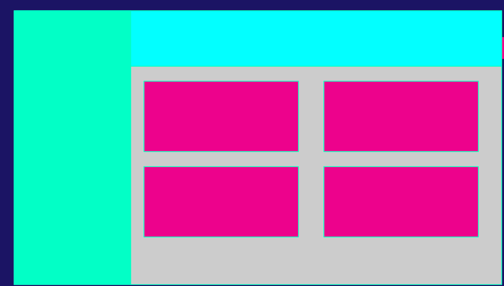
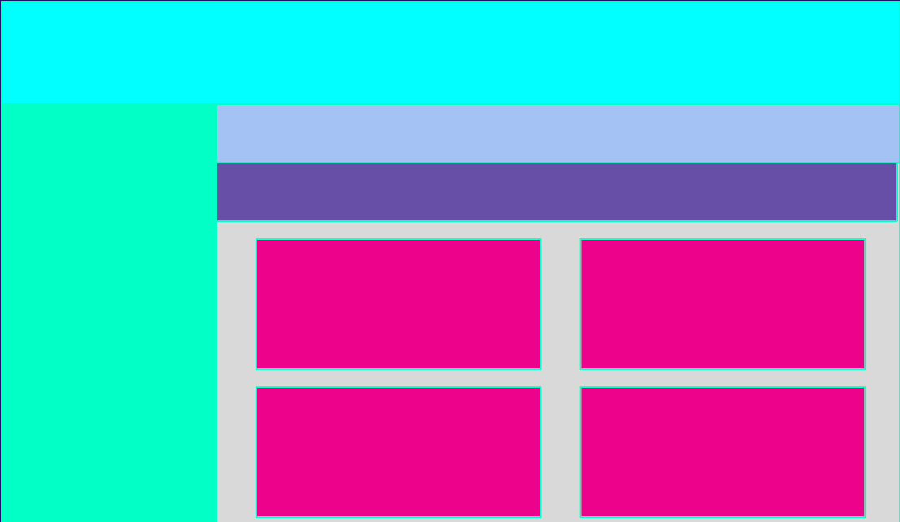

# Maquetation


## Activity 1 - AI Responses



### How to extend a child to fill a container
To make a child element fill its container, use **CSS Flexbox** by setting the parent to `display: flex` and the child to `flex-grow: 1` or `flex: 1`. Alternatively, set `width: 100%` and `height: 100%` on the child if the parent has defined dimensions. For Figma, select the child and set its resizing to "Fill container".

**Top Methods to Fill Containers:**
* **Flexbox (Recommended):** Set the parent container to `display: flex;` and the child item to `flex-grow: 1;`. This allows the child to expand to take up all remaining available space.
* **CSS width: 100% / height: 100%:** Set the child's width and height to 100%. **Note:** For this to work, the parent container must have a defined size.
* **Grid Layout:** In a CSS Grid, setting child items to span the full row/column (`grid-column: 1 / -1`) will stretch them to fill the container.
* **Figma Auto Layout:** If using Auto Layout, select the child element and change its horizontal/vertical resizing options to **Fill container**.


---

### How to tell a div to use all height space

Using Percentages (Parent Dependency):
Note: You must give the parent a height for this to work.

**Using Viewport Units:**
```css
.full-height {
    height: 100vh;
}

html, body {
    height: 100%;
    margin: 0;
}

.child {
    height: 100%;
}
```

## Activity 2 - Change of the layout



### Internet Search / AI Responses
Neither the internet nor AI was used to complete the activity.

### Was it possible to change the code? Did the refactor took more time?
Yes. It was possible to change the code to achieve the new layout. Nevertheless, big changes were made to the code because is not modular. It was necessary to modify the CSS of some elements, other new elementes were created with new CSS and the order and nesting of the html was also changed.

